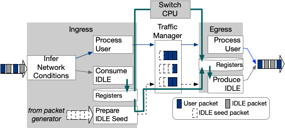

# OrbWeaver

### Description

OrbWeaver is a lightweight mechanism to provide weaved stream abstraction, enabling opportunistic exploitation of IDLE cycles for in-network communication. The figure below illustrates the generic structure of a switch program that processes a weaved stream. An application can leverage either seed packets in the data path or switch CPU to disseminate information across local pipelines.

<p align="center">
  
</p>

The repo contains an example OrbWeaver mechanism inline with a minimal p4 user program for a tofino pipeline with fully connected 100G quads, so that one could adapt the scripts based on the custom wiring, number of utilized pipelines and ports, and the target data plane application.
Metadata, actions, tables, and control blocks with `*_` suffix are for debugging purposes only.

The prototype was developed on testbed with a pair of Wedge100BF-32X Tofino switch and `bf-sde-9.2.0`.

The repo provides the corresponding implementation in both p4v14 and p4v16.

### How to Run

Point `SDE` to the SDE root dir, e.g., `echo "export SDE=/home/leoyu/bf-sde-9.2.0/" >> ~/.bashrc`

**p4v14**

1. Compile the example P4 program (or OrbWeaver with custom target data plane app):

```console
leoyu@localhost:~/OrbWeaver/p4v14/dp$ sudo -E ./compile.sh orbweaver.p4
```

2. Launch the switch daemon process to configure the seed generation, queues, and buffers:

```console
# Usage: ./launch.sh [-t ethertype_seed] [-g gap_seed] [-p prot_seed] <p4prog_name>
leoyu@localhost:~/OrbWeaver/p4v14/cp$ sudo -E ./launch.sh -t 0x1234 -g 59 -p 0x11 orbweaver
```

3. Enable ports, create multicast groups, and configure data plane states: `python orbweaver.py`

4. Sanity check: `python orbweaver.py debug`. By default, this records 0.1s worth of example debugging stats.
    * Accounting for packet counts per weaved stream at both ingress (upstream) and egress (downstream)
    * Histogram of seed stream gap [ns] for a pipeline
    * Histogram of multicast groups usage
    * Histogram of weaved stream gap [ns] for an egress port
    * Ring buffer of gaps [ns] for a substream of an egressing weaved stream

**p4v16**

1. Install SDE with proper prerequisites: `python make.py sde -r /home/leoyu/bf-sde-9.2.0/ -b /home/leoyu/bf-reference-bsp-9.2.0/ -t hw`

2. Compile orbweaver program in p4-16: `python make.py compile main.p4 /home/leoyu/OrbWeaver/p4v16/out`

3. Run switchd with OrbWeaver configuration: `python make.py switchd /home/leoyu/OrbWeaver/p4v16/main.cpp /home/leoyu/OrbWeaver/p4v16/out/ -t 0x1234 -g 59 -p 0x11`

4. Enable ports, configure PRE, set data plane states: `python orbweaver.py`

5. Sanity check: `python orbweaver.py debug`

### Further Questions

For more details, please refer to our NSDI 2022 paper: [OrbWeaver: Using IDLE Cycles in Programmable networks for Opportunistic Coordination](https://www.usenix.org/system/files/nsdi22-paper-yu.pdf).

```
@inproceedings {orbweaver,
author = {Liangcheng Yu and John Sonchack and Vincent Liu},
title = {OrbWeaver: Using IDLE Cycles in Programmable Networks for Opportunistic Coordination},
booktitle = {19th USENIX Symposium on Networked Systems Design and Implementation (NSDI 22)},
year = {2022},
isbn = {978-1-939133-27-4},
address = {Renton, WA},
pages = {1195--1212},
url = {https://www.usenix.org/conference/nsdi22/presentation/yu},
publisher = {USENIX Association},
month = apr,
}
```

Feel free to post [issues](https://github.com/eniac/OrbWeaver/issues) or contact `leoyu@seas.upenn.edu` if any question arises.

